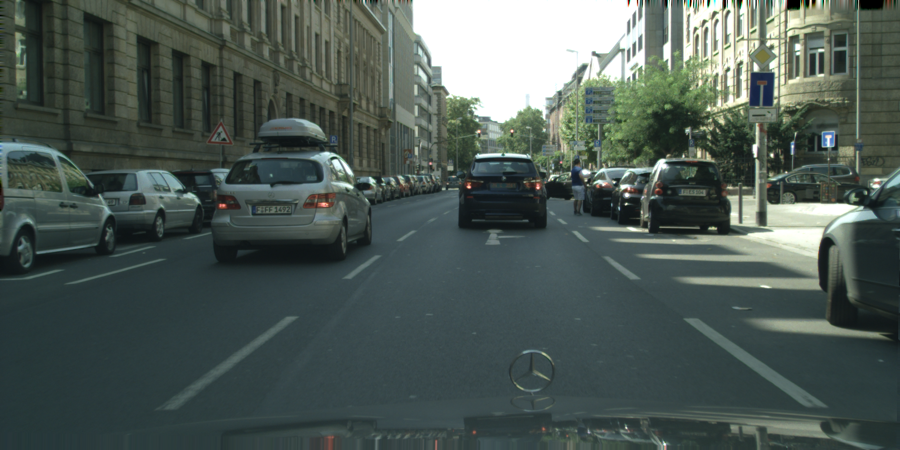
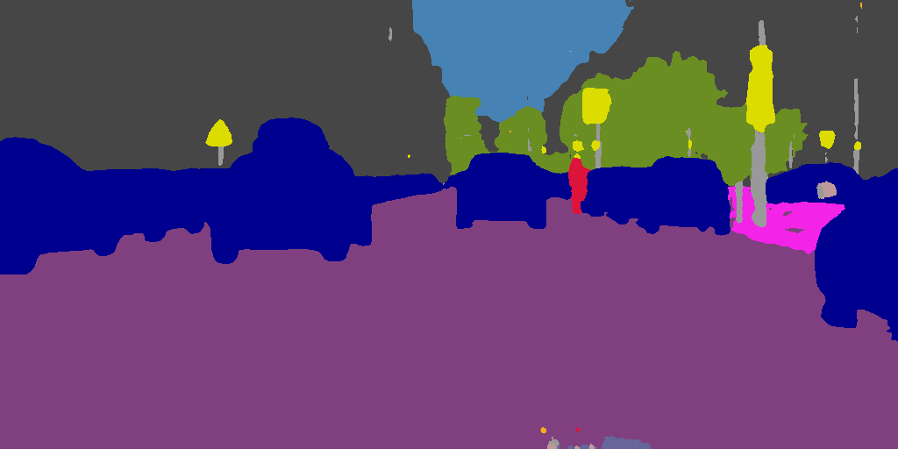
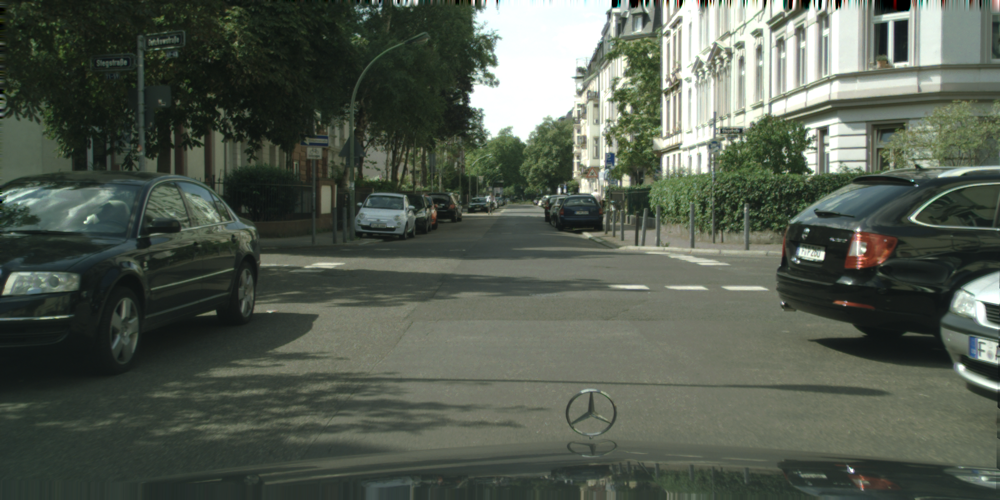
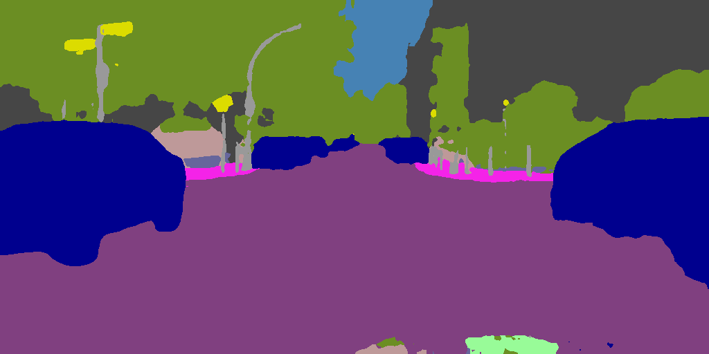
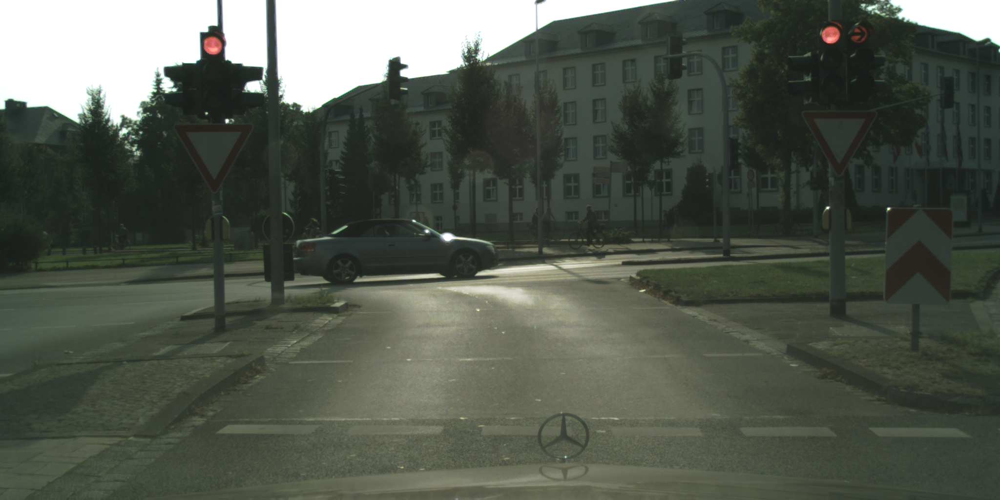
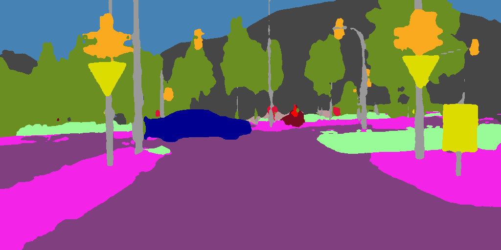

# Semantic Segmentation using SegFormer for Urban Scenes

This project trains a semantic segmentation model for urban scene understanding using a SegFormer-based architecture inspired by the original SegFormer paper. It is designed for the Cityscapes dataset and predicts 19 semantic classes such as road, building, sky, vehicle, and person.

| Original | Predicted Mask |
|:---:|:---:|
|  |  |
|  |  |
|  |  |


## What this project does

- Trains a segmentation model from RGB images to pixel-wise class labels
- Uses a lightweight Mix Transformer encoder with an all-MLP decoder, following the SegFormer design from the paper
- Supports image and label augmentations during training
- Includes preprocessing for colorized label masks into indexed labels
- Saves the best model checkpoint during training

## Project structure

- `train.py` - main training loop
- `model.py` - SegFormer-style model architecture
- `loss.py` - segmentation loss function
- `augmentations.py` - training-time augmentations
- `checkpoints/` - saved model weights
- `dataset/` - training and validation images/labels


## Training

Start training with:

```bash
python train.py
```

Useful options:

```bash
python train.py --epochs 100 --batch-size 16
```

## Output

During training, the script prints loss and mIoU values for both training and validation. The best checkpoint is saved to:

```text
checkpoints/best_miou.pt
```

## Notes

- The default image size is 512x1024.
- The model is configured for 19 semantic classes.
- If `segformer_b1_pretrained_encoder.pth` is present, the encoder weights are loaded before training.
- The model was trained using Cityscapes dataset

## Reference

- Xie, E., Wang, W., Yu, Z., Anandkumar, A., Alvarez, J. M., & Luo, P. (2021). SegFormer: Simple and Efficient Design for Semantic Segmentation with Transformers. arXiv.
  https://arxiv.org/abs/2105.15203

